# SaaS Productivity Suite — Architecture

## 1. Overall Architecture

The SaaS Productivity Suite is a full-stack collaborative productivity platform. It follows a **modular monorepo** layout with a **FastAPI async backend** and a **React SPA frontend**, communicating over REST and WebSockets.

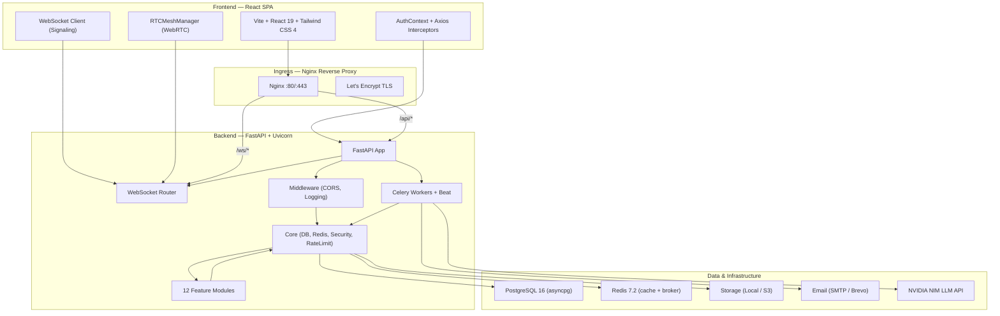

---

## 2. Technology Stack

| Layer | Technology |
|-------|-----------|
| Frontend | React 19, Vite 8, Tailwind CSS 4, shadcn/ui (Radix), Tiptap 3, Konva, Recharts, Framer Motion, React Query (TanStack), Phosphor Icons |
| Backend | Python 3.11, FastAPI, SQLAlchemy 2.0 (async), Pydantic v2, pydantic-settings |
| Database | PostgreSQL 16 (asyncpg driver, SQLAlchemy async) |
| Cache/Broker | Redis 7.2 (connection pool, Celery broker, session tokens, rate limiting) |
| Task Queue | Celery + Beat (autoretry, retry backoff) |
| Storage | Local filesystem (LOCAL) / AWS S3 (PRODUCTION) via Strategy pattern |
| Email | SMTP + Mailpit (LOCAL) / Brevo (PRODUCTION) |
| Real-time | WebSockets (FastAPI) + WebRTC mesh (browser-native) |
| AI | NVIDIA NIM (`meta/llama-3.3-70b-instruct`) via OpenAI-compatible client |
| Auth | JWT (HS256, access 15 min, refresh 7 days) + Google Identity Services (popup flow) + 2FA OTP |
| Infra | Docker Compose, Nginx (reverse proxy + TLS), Let's Encrypt |

---

## 3. Folder Structure

```
.
├── backend/
│   ├── app/
│   │   ├── core/                   # Cross-cutting concerns
│   │   │   ├── config.py           # Settings (pydantic-settings)
│   │   │   ├── database.py         # Async engine, session factory, Base
│   │   │   ├── redis.py            # Redis connection pool & health check
│   │   │   ├── security.py         # Password hashing (pwdlib+bcrypt), JWT
│   │   │   ├── rate_limit.py       # Sliding-window rate limiter (Redis)
│   │   │   ├── storage.py          # StorageProvider ABC + Local/S3 implementations
│   │   │   ├── email.py            # EmailProvider ABC + SMTP/Brevo implementations
│   │   │   ├── providers.py        # Factory functions for storage & email
│   │   │   ├── websocket_manager.py# Global WebSocket room/broadcast manager
│   │   │   ├── middleware.py       # CORS, request logging, timing headers
│   │   │   └── logger.py
│   │   ├── models/                 # SQLAlchemy ORM models
│   │   │   ├── user.py
│   │   │   ├── meetings.py
│   │   │   ├── tasks.py
│   │   │   ├── notes.py
│   │   │   ├── calender.py
│   │   │   ├── whiteboard.py
│   │   │   ├── reminders.py
│   │   │   ├── attachment.py
│   │   │   ├── entity_link.py
│   │   │   ├── meeting_suggested_task.py
│   │   │   └── notification.py
│   │   ├── modules/                # Feature modules (vertical slices)
│   │   │   ├── auth/
│   │   │   ├── users/
│   │   │   ├── calender/
│   │   │   ├── notes/
│   │   │   ├── tasks/
│   │   │   ├── meetings/
│   │   │   ├── whiteboard/
│   │   │   ├── reminders/
│   │   │   ├── attachments/
│   │   │   ├── entity_links/
│   │   │   ├── ai_suggestions/
│   │   │   └── notifications/
│   │   ├── workers/
│   │   │   └── tasks.py            # Celery tasks (email, reminders, AI, push)
│   │   ├── utils/
│   │   │   └── tiptap_converter.py
│   │   └── main.py                 # FastAPI app factory, router inclusion, lifespan
│   ├── tests/
│   └── alembic/                    # DB migrations
├── frontend/
│   ├── src/
│   │   ├── app/
│   │   ├── features/               # Feature-based modules (mirrors backend)
│   │   │   ├── auth/
│   │   │   ├── meetings/
│   │   │   ├── tasks/
│   │   │   ├── notes/
│   │   │   ├── calendar/
│   │   │   ├── whiteboards/
│   │   │   ├── settings/
│   │   │   ├── dashboard/
│   │   │   ├── profile/
│   │   │   └── notifications/
│   │   ├── shared/                 # Shared components (RichTextEditor, etc.)
│   │   ├── components/             # shadcn/ui primitives
│   │   ├── context/                # AuthContext, ThemeContext, SidebarContext
│   │   ├── layouts/                # MainLayout, AuthLayout, Header, Sidebar
│   │   ├── lib/                    # axios client, queryClient, utils, timezone
│   │   └── routes/AppRoutes.jsx
│   ├── index.css
│   ├── main.jsx
│   └── vite.config.js
├── docker-compose.yml
├── .env.example
└── README.md
```

---

## 4. Backend Architecture

### 4.1 Repository Pattern

Each module follows a **three-layer architecture**:

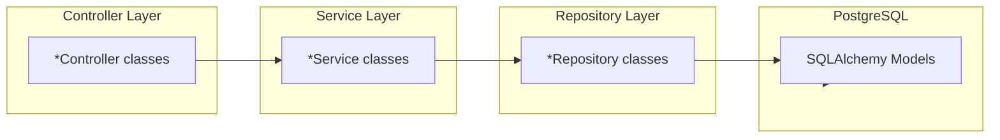

**Repository** (`app.modules.<module>.repository`):
- Encapsulates all SQLAlchemy queries.
- Receives an `AsyncSession` in `__init__`.
- Returns ORM objects or raw tuples (for analytical queries).
- No business logic — only persistence concerns.

**Service** (`app.modules.<module>.service`):
- Orchestrates business rules.
- Calls one or more repositories.
- Invokes core providers (storage, email, AI).
- Raises domain exceptions (`*NotFoundException`, `*AccessDeniedException`, `*ValidationError`).

**Controller** (`app.modules.<module>.controller`):
- Thin adapter between FastAPI routes and the service layer.
- Validates inputs via Pydantic schemas.
- Maps domain exceptions to HTTP responses (`404`, `403`, `400`, `422`).
- Returns validated response DTOs (`model_validate`).

### 4.2 Dependency Injection

FastAPI’s `Depends` is the primary DI mechanism. Dependencies are defined in `app.modules.<module>.dependencies`:

- `get_db` — yields an `AsyncSession`.
- `get_current_user_id` — extracts and validates the authenticated user.
- `get_optional_user_id` — same, but allows anonymous access (guests).
- `get_redis_client` — yields a Redis connection from the global pool.
- Module-specific providers, e.g. `get_meetings_service`, `get_attachment_service`.

Services are instantiated per-request in dependencies, receiving repositories and core services:

```python
# Example: app.modules.meetings.dependencies.py
async def get_meetings_service(db: AsyncSession = Depends(get_db), redis: Redis = Depends(get_redis_client)):
    repo = MeetingRepository(db)
    storage = get_storage_service("meetings")
    session_service = MeetingSessionService(
        MeetingSessionRepository(db), redis, meeting_repo=repo
    )
    auth_service = SessionAuthorizationService(...)
    return MeetingService(repo, storage, session_service, auth_service)
```

### 4.3 Controller Layer

Controllers are pure functions that delegate to services. Example:

```python
class MeetingController:
    def __init__(self, service: MeetingService):
        self.service = service

    async def create_meeting(self, host_id: UUID, payload: MeetingCreate) -> dict:
        meeting = await self.service.create_meeting(host_id, payload)
        return MeetingResponse.model_validate(meeting)
```

Routes in `app.modules.<module>.routes` instantiate controllers or accept them via dependency injection:

```python
@router.post("/", status_code=201, response_model=MeetingResponse)
async def create_meeting_endpoint(
    payload: MeetingCreate,
    current_user_id: UUID = Depends(get_current_user_id),
    service = Depends(get_meetings_service)
):
    ctrl = MeetingController(service)
    return await ctrl.create_meeting(current_user_id, payload)
```

---

## 5. Frontend Architecture

### 5.1 Feature-First Structure

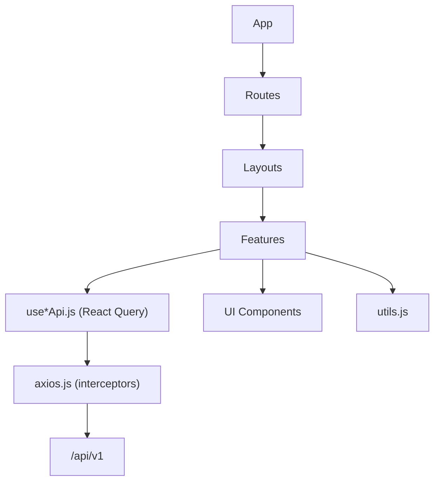

### 5.2 Authentication Flow (Frontend)

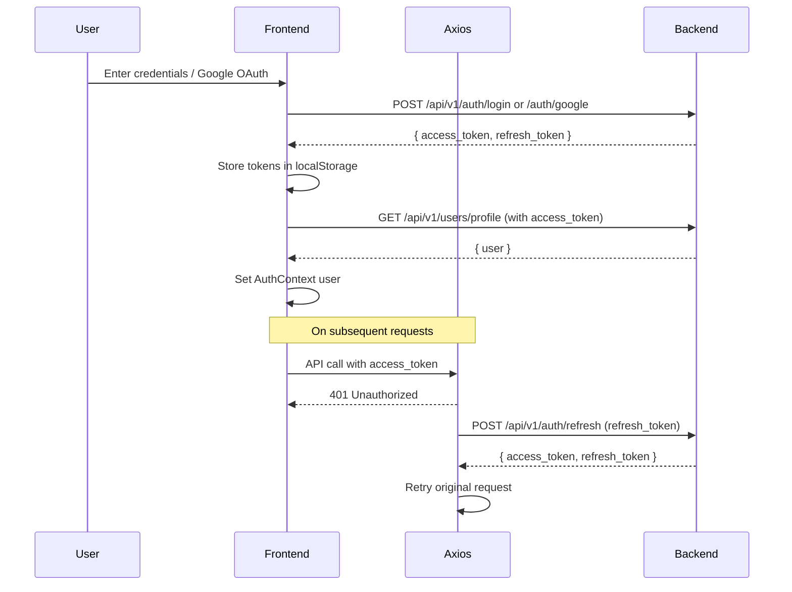

### 5.3 Guest Session (Meeting)

Non-authenticated users can join meetings as guests via a link (`/m/:meetingCode`). The frontend stores guest identity in `sessionStorage` and passes it to the WebSocket connection.

---

## 6. Core Infrastructure

### 6.1 Database

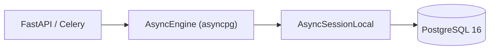

- `engine` — `create_async_engine` with `pool_pre_ping=True`.
- `AsyncSessionLocal` — `async_sessionmaker` with `expire_on_commit=False`.
- `Base` — `declarative_base()` for all ORM models.
- `get_db` — FastAPI dependency yielding `AsyncSession`, auto-commit/rollback.

### 6.2 Redis

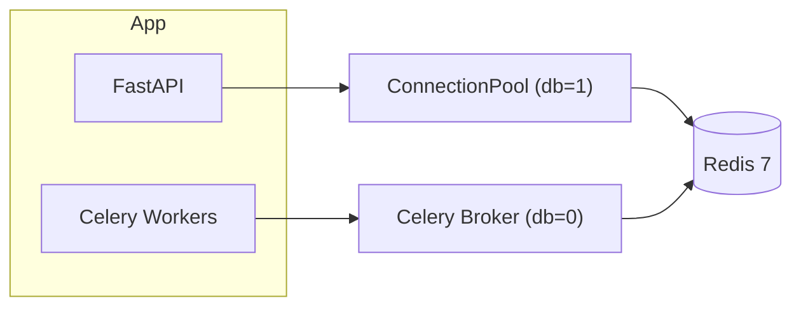

Redis is used for:
- **Session tokens** (`session:{user_id}`) — refresh token whitelisting.
- **OTP / Reset tokens** (`otp:signup:`, `otp:login:`, `reset:`) — short-lived auth flows.
- **Rate limiting** — sliding window counters per endpoint/IP/user.
- **Meeting live state** (`meeting:{meeting_id}`) — active session ID cache.
- **Celery broker** — task queue backend.

### 6.3 Security

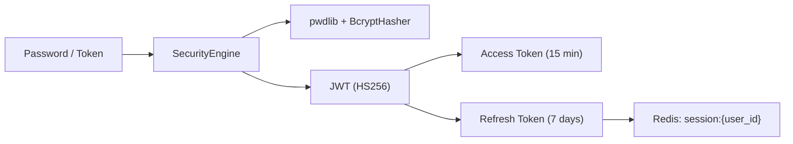

- Passwords are hashed with **bcrypt** via `pwdlib`.
- JWTs carry `sub` (user_id) and `email`.
- Refresh tokens are whitelisted in Redis; password change or account deactivation revokes them.
- 2FA OTPs are 6-digit codes stored in Redis with TTL.

### 6.4 Rate Limiting

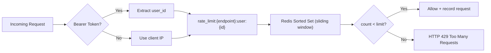

Implemented in `app.core.rate_limit.RateLimiter`:
- Uses a Redis sorted set with timestamps as scores.
- Atomic pipeline operations (`zremrangebyscore`, `zcard`, `zadd`).
- Falls open (logs error) if Redis is unavailable.

### 6.5 Provider Architecture

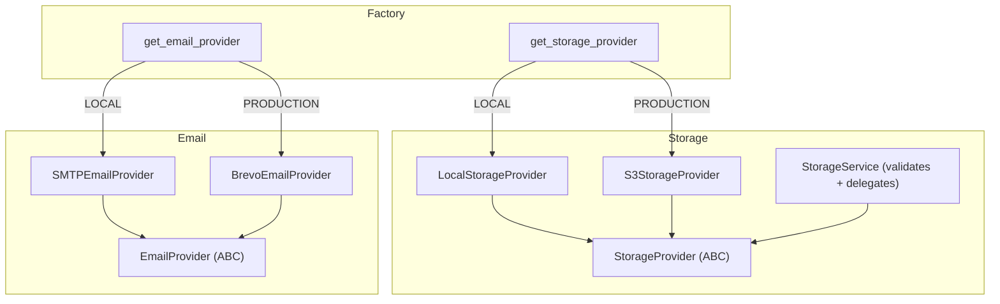

- **Storage**: `LocalStorageProvider` writes to `STORAGE_BASE_DIR`; `S3StorageProvider` uses `aioboto3`.
- **Email**: `SMTPEmailProvider` uses Python `smtplib`; `BrevoEmailProvider` uses `brevo` SDK.
- Selection is based on `settings.ENVIRONMENT`.

---

## 7. Docker Architecture

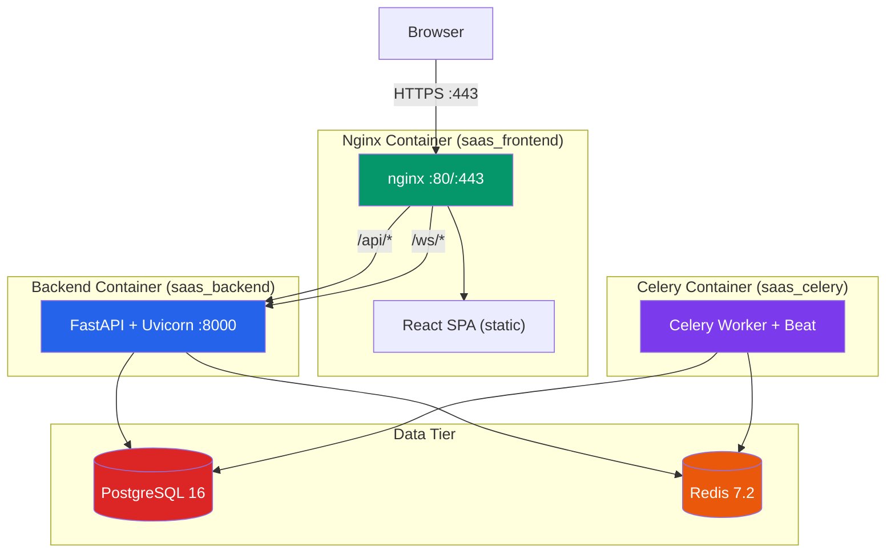

**Services**:
- `frontend` — React SPA served by Nginx with TLS termination. Reverse-proxies `/api/` and `/ws/` to the backend. Depends on backend health.
- `backend` — FastAPI + Uvicorn with dynamic worker count. Mounts `logs_data` and `uploads_data` volumes.
- `celery` — Shares the backend image; runs `celery_entrypoint.sh` for Beat + Worker.
- `postgres` — Primary data store with persistent volume.
- `redis` — Cache + Celery broker with AOF persistence.
- `mailpit` — SMTP catcher for local development (opt-in via `--profile local`).

---

## 8. Database Entities and Relationships

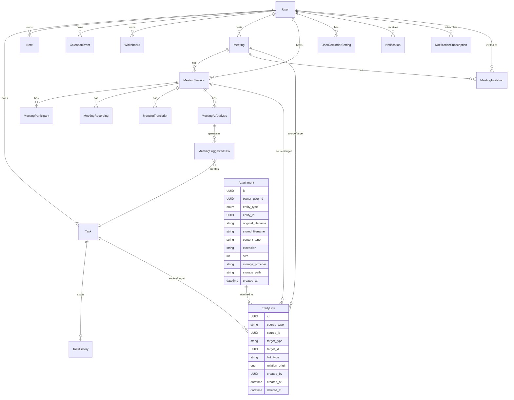

### 8.1 Entity Summary

| Model | Table | Key Fields |
|-------|-------|-----------|
| `User` | `users` | `id`, `email`, `password_hash`, `full_name`, `is_verified`, `is_2fa_enabled`, `timezone`, `google_id`, `oauth_provider` |
| `Task` | `tasks` | `id`, `user_id`, `title`, `description` (JSONB), `status`, `priority`, `due_date`, `labels` (JSONB), `checklist` (JSONB), `is_pinned`, `is_archived` |
| `TaskHistory` | `task_history` | `id`, `task_id`, `user_id`, `action`, `field_name`, `old_value`, `new_value` |
| `Note` | `notes` | `id`, `user_id`, `title`, `content`, `category`, `tags` (JSONB), `is_pinned`, `is_archived` |
| `CalendarEvent` | `calendar_events` | `id`, `user_id`, `title`, `event_type`, `color`, `start_time`, `end_time`, `timezone`, `is_all_day`, `recurrence_*` |
| `Whiteboard` | `whiteboards` | `id`, `user_id`, `title`, `board_data` (JSONB), `is_favorite`, `is_archived`, `is_deleted` |
| `Meeting` | `meetings` | `id`, `host_id`, `title`, `meeting_code`, `meeting_link`, `status`, `meeting_type`, `scheduled_start`, `timezone`, `agenda`, `enable_recording`, `enable_transcript`, `enable_ai_analysis` |
| `MeetingSession` | `meeting_sessions` | `id`, `meeting_id`, `host_id`, `status`, `started_at`, `ended_at`, `duration_seconds` |
| `MeetingParticipant` | `meeting_participants` | `id`, `session_id`, `user_id` (nullable), `guest_name`, `guest_email`, `participant_type`, `status`, `is_muted`, `can_start_screen_share`, `joined_at`, `left_at` |
| `MeetingRecording` | `meeting_recordings` | `id`, `session_id`, `filename`, `content_type`, `size`, `duration`, `storage_path` |
| `MeetingTranscript` | `meeting_transcripts` | `id`, `session_id`, `filename`, `content_type`, `size`, `storage_path` |
| `MeetingAIAnalysis` | `meeting_ai_analysis` | `id`, `session_id`, `provider`, `model`, `status`, `summary`, `agenda_coverage_percentage`, `covered_points` (JSON), `out_of_agenda_points` (JSON), `suggested_tasks` (JSON), `raw_response` (JSON) |
| `MeetingSuggestedTask` | `meeting_suggested_tasks` | `id`, `analysis_id`, `title`, `description`, `priority`, `status`, `created_task_id` |
| `MeetingInvitation` | `meeting_invitations` | `id`, `meeting_id`, `name`, `email` |
| `UserReminderSetting` | `user_reminder_settings` | `id`, `user_id`, `reminders_enabled`, `schedule_all`, `global_frequency`, `global_time`, `calendar_config` (JSON), `tasks_config` (JSON), `meetings_config` (JSON) |
| `Notification` | `notifications` | `id`, `user_id`, `type`, `title`, `body`, `extra_data` (JSONB), `is_read`, `sent_at` |
| `NotificationSubscription` | `notification_subscriptions` | `id`, `user_id`, `endpoint`, `p256dh`, `auth`, `browser` |
| `Attachment` | `attachments` | Generic polymorphic attachment owned by any entity via `entity_type` + `entity_id`. |
| `EntityLink` | `entity_links` | Generic relationship between any two entities. |

---

## 9. Meeting Session Engine

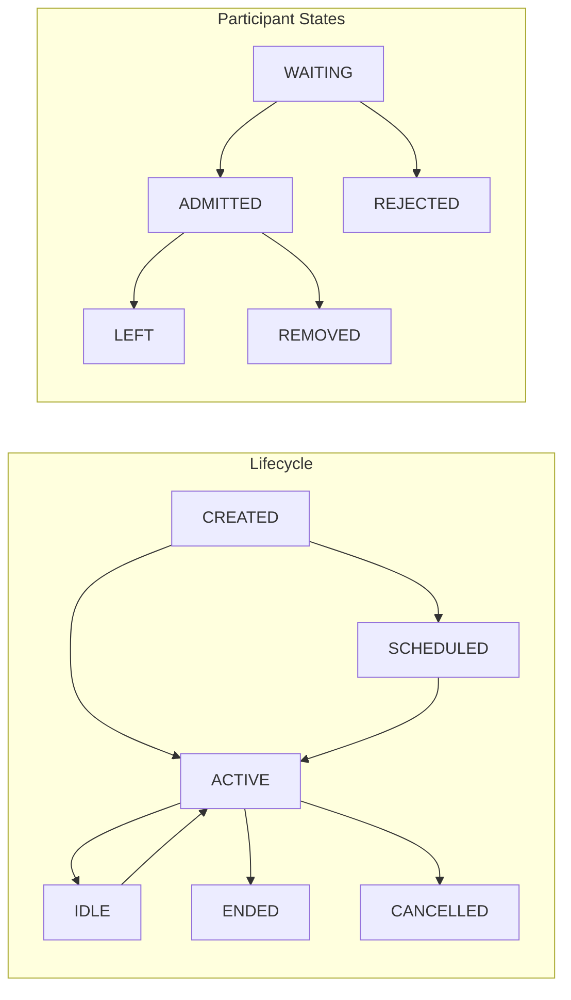

### 9.1 Meeting Lifecycle

1. **Creation** — Host creates an instant or scheduled meeting. Scheduled meetings store `scheduled_start`, `timezone`, and `agenda`.
2. **Invitation** — For scheduled meetings, hosts invite participants by email. Celery Beat checks upcoming meetings every minute and sends push notifications. Emails are sent asynchronously via Celery.
3. **Joining** — Users join via `/api/v1/meetings/{id}/join` or WebSocket. Registered users are auto-admitted as host; guests and non-host users enter `WAITING`.
4. **Waiting Room** — Host admits/rejects/removes participants via REST endpoints, which broadcast WebSocket events.
5. **Active Session** — First admit creates a `MeetingSession`. Subsequent joins reuse the active session. Screen sharing is tracked via `active_screen_sharer_id`.
6. **Ending** — Host ends the meeting. Active session finishes, recordings/transcripts are processed, and the completion pipeline is triggered.
7. **Completion** — Celery worker reads transcripts, runs AI analysis, creates suggested tasks, and sends completion email.

### 9.2 Meeting Session Lifecycle

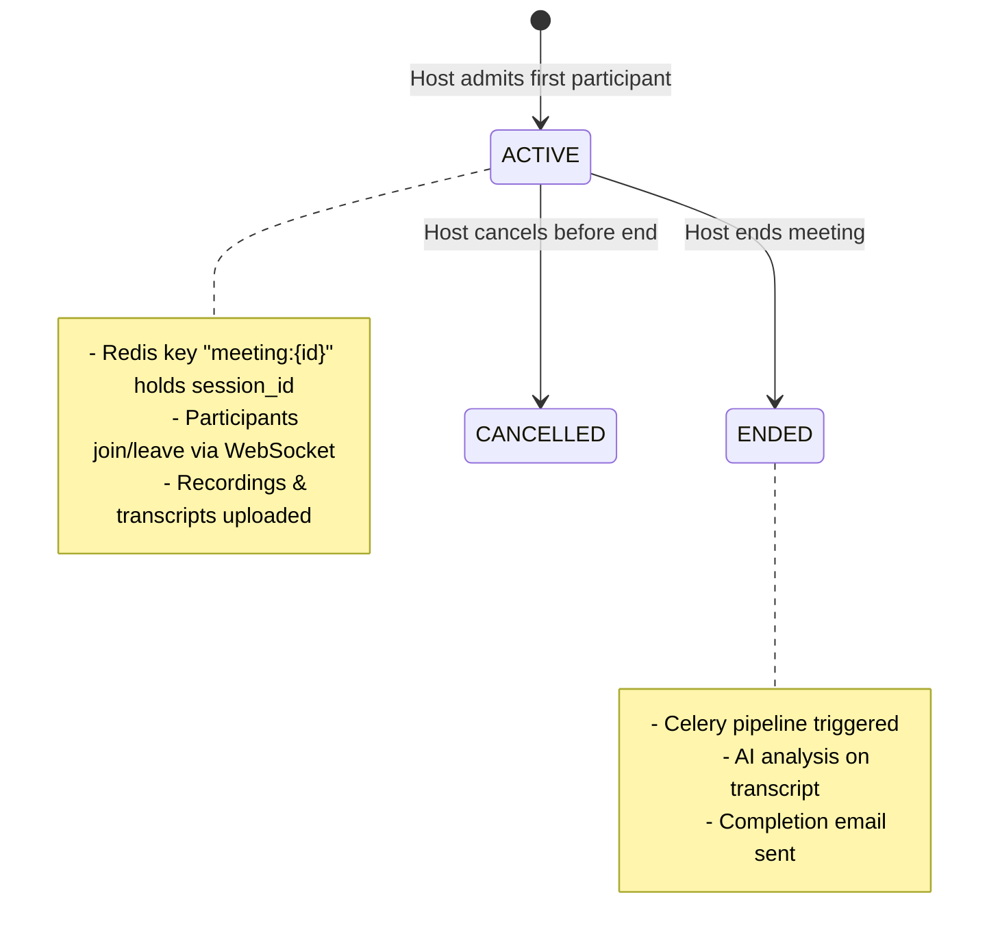

### 9.3 WebSocket Signaling

The WebSocket router (`app.modules.meetings.websocket`) handles real-time signaling at `/ws/meetings/{meeting_id}`.

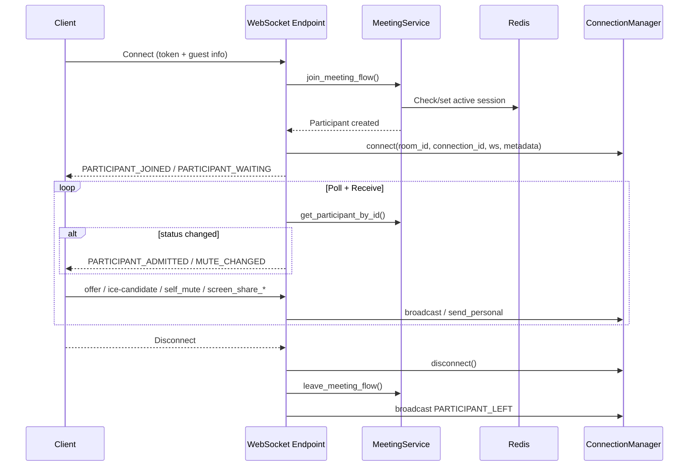

---

## 10. Attachment Upload Flow

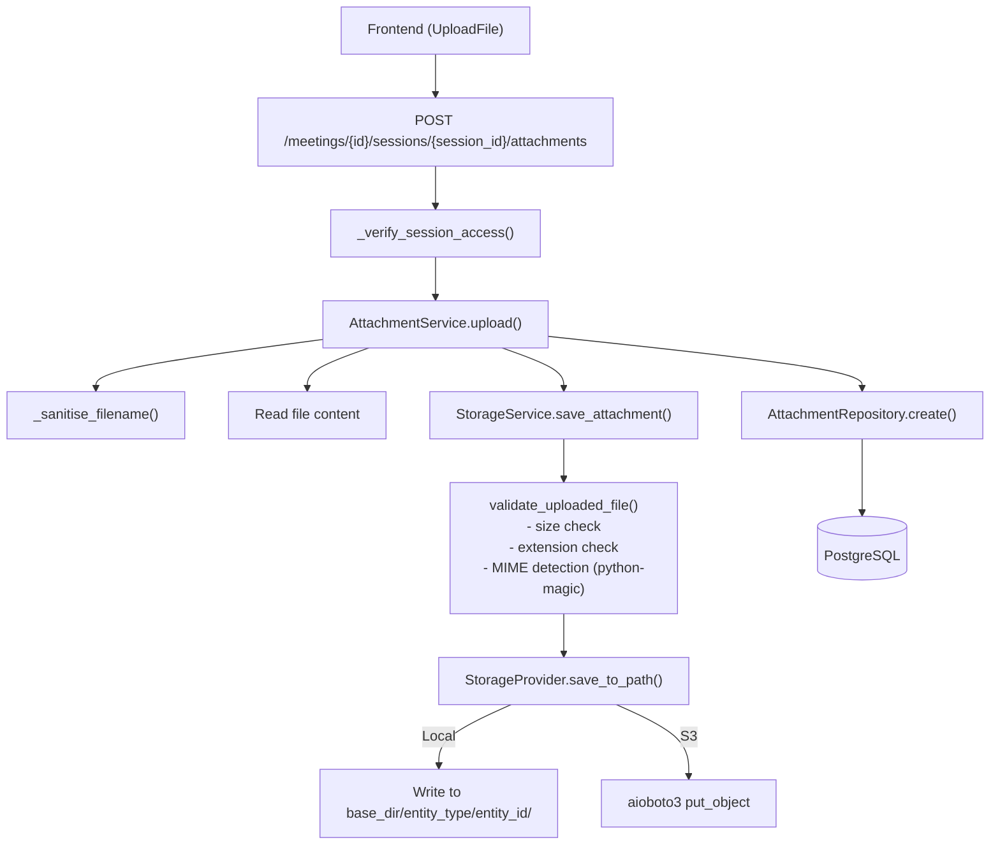

---

## 11. AI Analysis Flow

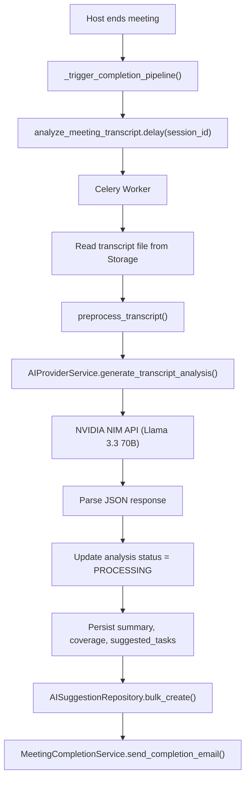

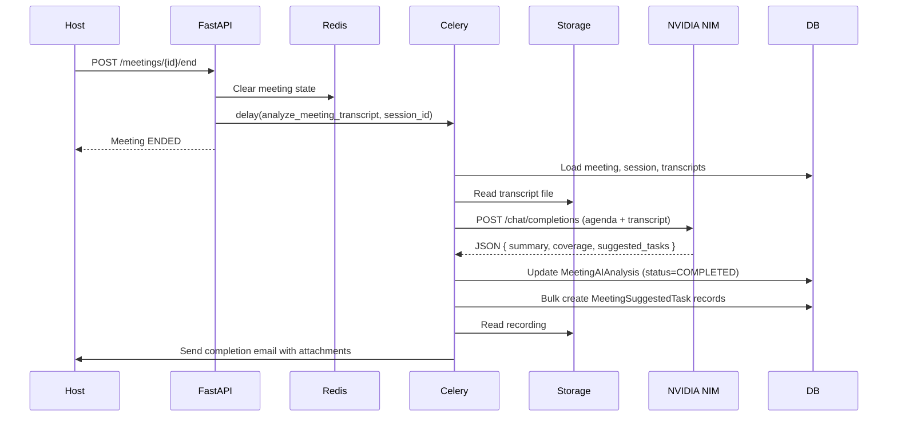

---

## 12. Authentication Flow

```mermaid
flowchart TD
    subgraph "Registration"
        Signup["POST /auth/signup"] --> CreateUser["Create User (unverified)"]
        CreateUser --> GenOTP["Generate 6-digit OTP"]
        GenOTP --> StoreOTP["Redis: otp:signup:{token} = {email, otp}"]
        StoreOTP --> SendEmail["Celery: send_async_email(OTP)"]
        SendEmail --> Verify["POST /auth/verify-signup"]
        Verify --> ValidateOTP["Validate OTP in Redis"]
        ValidateOTP --> MarkVerified["Mark user is_verified=True"]
        MarkVerified --> IssueTokens["Issue JWT + store refresh in Redis"]
    end

    subgraph "Login"
        Login["POST /auth/login"] --> CheckPwd["Verify password"]
        CheckPwd -->|2FA enabled| GenLoginOTP["Generate 6-digit OTP"]
        GenLoginOTP --> StoreLoginOTP["Redis: otp:login:{token}"]
        StoreLoginOTP --> SendLoginEmail["Celery: send_async_email(OTP)"]
        SendLoginEmail --> VerifyLogin["POST /auth/verify-login"]
        VerifyLogin --> ValidateLoginOTP["Validate OTP"]
        ValidateLoginOTP --> IssueLoginTokens["Issue JWT + store refresh in Redis"]
        CheckPwd -->|No 2FA| IssueLoginTokens
    end

    subgraph "Google OAuth"
        Google["POST /auth/google"] --> VerifyToken["google.oauth2.id_token.verify_oauth2_token"]
        VerifyToken --> FindUser["Find by google_id or email"]
        FindUser -->|Exists| Check2FA
        FindUser -->|New| CreateOAuthUser["Create OAuth-only user"]
        CreateOAuthUser --> Check2FA{"2FA enabled?"}
        Check2FA -->|Yes| GenLoginOTP
        Check2FA -->|No| IssueGoogleTokens["Issue JWT + store refresh in Redis"]
    end

    subgraph "Token Refresh"
        Refresh["POST /auth/refresh"] --> DecodeRefresh["Decode refresh token"]
        DecodeRefresh --> CheckWhitelist["Redis: session:{user_id}"]
        CheckWhitelist -->|Match| RotateTokens["Issue new JWT pair"]
        CheckWhitelist -->|Mismatch| Reject["401 Unauthorized"]
    end
```

---

## 13. Task Flow

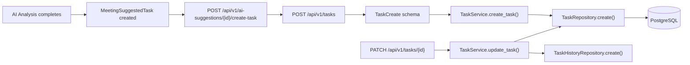

---

## 14. Relation Flow

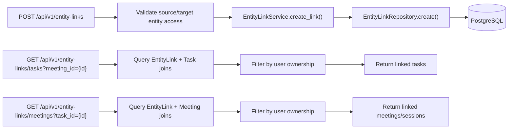

---

## 15. Dashboard

The dashboard (`/dashboard`) is a feature module that aggregates data from all other modules:
- Upcoming calendar events.
- Pending tasks with due dates.
- Recent meetings and upcoming scheduled meetings.
- Recent AI analyses.
- Unread notifications.

It uses React Query for parallel data fetching and aggregates results client-side.

---

## 16. Security Summary

| Mechanism | Implementation |
|-----------|---------------|
| Authentication | JWT (HS256) — 15 min access, 7 day refresh |
| Session Management | Redis whitelist (`session:{user_id}`) — revoked on password change / deactivation |
| Password Hashing | `pwdlib` + `BcryptHasher` |
| 2FA | 6-digit OTP via email, stored in Redis with TTL |
| OAuth | Google Identity Services — popup flow, ID token verified server-side with `google.oauth2.id_token.verify_oauth2_token` |
| Authorization | Per-module checks (host-only, participant-only, owner-only) |
| Rate Limiting | Redis sliding window per endpoint/IP/user |
| CORS | `allow_origins=["*"]` with credentials (intended for nginx reverse proxy in production) |
| File Upload Validation | Extension allowlist + MIME detection (`python-magic`) + size limit |

---

## 17. Celery Tasks

| Task Name | Schedule | Description |
|-----------|----------|-------------|
| `tasks.process_all_reminders` | Every 30 min | Scans upcoming meetings, calendar events, and tasks; sends email reminders based on user preferences. |
| `tasks.send_meeting_push_reminders` | Every 60s | Finds scheduled meetings starting within 10 minutes and sends browser push notifications + in-app notifications. |
| `tasks.analyze_meeting_transcript` | On-demand (triggered on meeting end) | Reads transcript, runs NVIDIA NIM AI analysis, persists results, creates suggested tasks, sends completion email. |
| `tasks.send_async_email` | On-demand | Sends plain-text email via SMTP/Brevo with autoretry. |
| `tasks.send_html_email` | On-demand | Sends HTML email with optional attachments via SMTP/Brevo with autoretry. |

---

## 18. Summary

| Concern | Detail |
|---------|--------|
| **Pattern** | Repository → Service → Controller (vertical slice modules) |
| **DB Access** | SQLAlchemy 2.0 async, `AsyncSession` per request |
| **Real-time** | WebSocket signaling + WebRTC mesh (browser-native) |
| **Background** | Celery + Redis broker + Beat scheduler |
| **Storage** | Strategy pattern (Local vs S3), validated uploads |
| **Email** | Strategy pattern (SMTP vs Brevo), async via Celery |
| **Auth** | JWT + Google Identity Services + Redis session whitelist + 2FA OTP |
| **AI** | NVIDIA NIM (Llama 3.3 70B), triggered by Celery on meeting end |
| **Rate Limiting** | Redis sliding window, fails open |
| **Frontend** | React Query for server state, Axios interceptors for token refresh, feature-first organization |
| **Deployment** | Docker Compose, Nginx reverse proxy with TLS, Let's Encrypt, DuckDNS |
