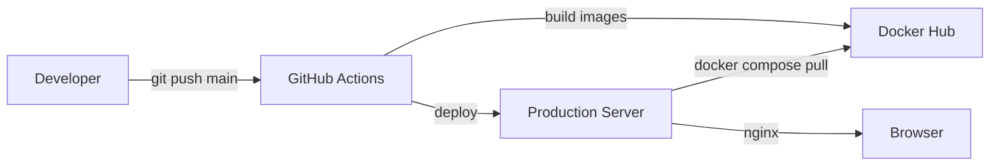

# Production Deployment Guide

This document is the single source of truth for production deployment, operations, and troubleshooting.

---

## Production Architecture

```
Internet
    |
DuckDNS (unified-workspace.duckdns.org)
    |
HTTPS (:443)
    |
Nginx Container
    |-- React SPA (static files)
    |-- /api/*  -->  FastAPI :8000
    |-- /ws/*   -->  FastAPI :8000 (WebSocket)
    |-- /docs   -->  FastAPI Swagger UI
    |-- /redoc  -->  FastAPI ReDoc
    |
FastAPI Container
    |-- PostgreSQL 16
    |-- Redis 7.2
    |
Celery Container (shares backend image)
    |-- Worker (email, AI analysis, push notifications)
    |-- Beat (reminder sweeps, meeting push reminders)
```

---

## Deployment Architecture



The CI/CD pipeline runs on push to `main` or via manual `workflow_dispatch`:

1. **Lint & Test** -- Backend (ruff, black, isort, pytest) and Frontend (eslint, prettier, vite build)
2. **Build & Push** -- Docker images built and pushed to Docker Hub
3. **Deploy** -- Self-hosted runner pulls images and restarts containers
4. **Migrate** -- Alembic runs `upgrade head` inside the backend container
5. **Health Check** -- Verifies backend and frontend respond through nginx

---

## Docker Compose Architecture

### Services

| Service | Image | Port | Purpose |
|---|---|---|---|
| `frontend` | Custom (nginx) | 80, 443 | React SPA + reverse proxy + TLS |
| `backend` | Custom (FastAPI) | 8000 (internal) | REST API + WebSocket |
| `celery` | Same as backend | -- | Worker + Beat scheduler |
| `postgres` | `postgres:16-alpine` | 5432 | Primary data store |
| `redis` | `redis:7.2-alpine` | 6379 | Cache, sessions, Celery broker |
| `mailpit` | `axllent/mailpit:v1.15` | 1025, 8025 | Dev SMTP (opt-in via `--profile local`) |

### Container Descriptions

**Frontend (`saas_frontend`)**
- Multi-stage build: Node 22-alpine (build) then nginx:stable-alpine (runtime)
- Serves compiled React SPA from `/usr/share/nginx/html`
- Reverse-proxies `/api/` to `http://backend:8000` (600s timeout)
- Reverse-proxies `/ws/` to `http://backend:8000` with WebSocket upgrade (86400s timeout)
- TLS termination via Let's Encrypt certificates
- Health check: `wget -qO- http://localhost/nginx-health`

**Backend (`saas_backend`)**
- Multi-stage build: Python 3.11-slim with pip, non-root `appuser`
- Entrypoint waits for PostgreSQL, then starts Uvicorn
- Dynamic worker count in PRODUCTION: `max((cpu_cores * 2) + 1, 2)`
- Health check: `python -c "import urllib.request; urllib.request.urlopen('http://localhost:8000/health')"`
- Volumes: `logs_data` at `/app/logs`, `uploads_data` at `/app/downloads`

**Celery (`saas_celery`)**
- Reuses the backend image with a different entrypoint
- Runs both Celery Worker and Celery Beat via `start_celery.py`
- Health check: `celery inspect ping`

**PostgreSQL (`saas_postgres`)**
- Persistent named volume `saas_postgres_data`
- Health check: `pg_isready`
- Password required: fails fast if `POSTGRES_PASSWORD` is missing

**Redis (`saas_redis`)**
- AOF persistence enabled (`--appendonly yes`)
- Persistent named volume `saas_redis_data`
- Health check: `redis-cli ping`

### Networks

| Network | Containers |
|---|---|
| `saas_backend_net` | frontend, backend, celery, postgres, redis, mailpit |
| `saas_frontend_net` | frontend only |

The frontend container joins both networks to reach the backend by service name while remaining the sole entry point for browser traffic.

### Volumes

| Volume | Mount | Purpose |
|---|---|---|
| `saas_postgres_data` | `/var/lib/postgresql/data` | Database files |
| `saas_redis_data` | `/data` | Redis AOF persistence |
| `saas_mailpit_data` | `/data` | Captured emails |
| `saas_logs_data` | `/app/logs` | Application logs |
| `saas_uploads_data` | `/app/downloads` | User-uploaded files |

---

## Network Flow

```
Browser
    |
    v  HTTPS :443
Nginx Container
    |
    +---> /assets/*  --> static files (1 year cache, immutable)
    +---> /api/health --> http://backend:8000/health (exact match)
    +---> /api/*     --> http://backend:8000 (reverse proxy)
    +---> /ws/*      --> http://backend:8000 (WebSocket upgrade)
    +---> /docs      --> http://backend:8000/docs
    +---> /redoc     --> http://backend:8000/redoc
    +---> /*         --> /usr/share/nginx/html/index.html (SPA fallback)
```

---

## HTTPS Configuration

### DuckDNS

The application uses [DuckDNS](https://www.duckdns.org) for dynamic DNS:

- **Domain:** `unified-workspace.duckdns.org`
- **Record type:** A record pointing to the production server's public IP
- DuckDNS supports automatic IP updates via cron or API calls

### Let's Encrypt

TLS certificates are managed by [Let's Encrypt](https://letsencrypt.org) via Certbot:

- **Certificate path:** `/etc/letsencrypt/live/unified-workspace.duckdns.org/`
- **Files:** `fullchain.pem` and `privkey.pem`
- **Mount:** Read-only mount into the frontend container at `/etc/letsencrypt/`
- **Auto-renewal:** Certbot runs on the host via cron or systemd timer

### SSL Configuration

The nginx configuration enforces:

- TLS 1.2 and 1.3 only
- X25519 and SECP384R1 curves
- OCSP stapling enabled (resolvers: 1.1.1.1, 8.8.8.8)
- HSTS with 1-year max-age and includeSubDomains
- Session tickets disabled for forward secrecy

---

## Nginx Reverse Proxy

The nginx configuration serves dual purposes:

1. **Static file server** -- React SPA with aggressive caching for Vite-hashed assets
2. **Reverse proxy** -- forwards API and WebSocket traffic to the backend

### Proxy Rules

| Location | Target | Timeout | Notes |
|---|---|---|---|
| `= /api/health` | `http://backend:8000/health` | default | Exact match for CI health checks |
| `/api/` | `http://backend:8000` | 600s | All API endpoints |
| `/ws/` | `http://backend:8000` | 86400s | WebSocket with upgrade headers |
| `/docs` | `http://backend:8000/docs` | default | Swagger UI |
| `/redoc` | `http://backend:8000/redoc` | default | ReDoc |
| `/openapi.json` | `http://backend:8000/openapi.json` | default | OpenAPI schema |

### Why VITE_API_URL Is Empty

In Docker production, `VITE_API_URL` is intentionally left empty. The frontend builds with a relative API base URL (`/api/v1`), and nginx proxies `/api/*` to the backend. This means:

- **Development (local):** `VITE_API_URL=http://localhost:8000` -- axios makes direct requests to the backend
- **Production (Docker):** `VITE_API_URL=` (empty) -- axios makes relative requests to `/api/v1`, nginx forwards them

This is the correct architecture because the browser should never need to know the backend's internal hostname or port.

---

## GitHub Actions Deployment Flow

### Pipeline Structure

```
backend-lint --> backend-test --\
                                 --> build-and-push --> deploy --> db-init --> migrate --> health-check --> cleanup
frontend-lint ----------------/
```

### APP_ENV Secret

The `APP_ENV` GitHub Actions secret contains a JSON object with all environment variables needed by both the backend and frontend:

```json
{
  "ENVIRONMENT": "PRODUCTION",
  "POSTGRES_SERVER": "postgres",
  "POSTGRES_PORT": "5432",
  "POSTGRES_USER": "postgres",
  "POSTGRES_PASSWORD": "...",
  "POSTGRES_DB": "productivity_db",
  "JWT_SECRET_KEY": "...",
  "JWT_REFRESH_SECRET_KEY": "...",
  "REDIS_HOST": "redis",
  "REDIS_PORT": "6379",
  "REDIS_CELERY_BROKER_URL": "redis://redis:6379/0",
  "SMTP_HOST": "smtp.brevo.com",
  "SMTP_PORT": "587",
  "SMTP_USE_TLS": "True",
  "SMTP_FROM_EMAIL": "...",
  "GOOGLE_CLIENT_ID": "...",
  "FRONTEND_URL": "https://unified-workspace.duckdns.org",
  "STORAGE_BASE_DIR": "downloads",
  "MEETING_SESSION_TOKEN_EXPIRE_MINUTES": "60",
  "NVIDIA_NIM_API_KEY": "...",
  "BREVO_API_KEY": "...",
  "BREVO_FROM_EMAIL": "...",
  "AWS_ACCESS_KEY_ID": "...",
  "AWS_SECRET_ACCESS_KEY": "...",
  "AWS_REGION": "...",
  "AWS_STORAGE_BUCKET_NAME": "...",
  "VAPID_PRIVATE_KEY": "...",
  "VITE_API_URL": "",
  "VITE_GOOGLE_CLIENT_ID": "...",
  "VITE_VAPID_PUBLIC_KEY": "..."
}
```

### How APP_ENV Is Used

1. **CI build step** -- Extracts all `VITE_*` keys from `APP_ENV` and writes them to `frontend/vite.env`. The Dockerfile sources this file before `npm run build`.
2. **Deploy step** -- `deploy.sh` converts `APP_ENV` JSON to a flat `.env` file on the production server. The backend and celery containers read this via `env_file: .env`.
3. **DB init step** -- Sources the generated `.env` to get `POSTGRES_USER` and `POSTGRES_DB` for idempotent database creation.
4. **Migrate step** -- Runs `docker compose exec -T backend alembic upgrade head` inside the backend container.

### Image Tags

- **Docker Hub:** `chitrangpotdar/productivity-backend:latest` and `chitrangpotdar/productivity-frontend:latest`
- **Git SHA tag:** `chitrangpotdar/productivity-backend:<commit-sha>` (also pushed for traceability)

---

## Environment Variables

### Frontend (Build-Time)

| Variable | Production Value | Purpose |
|---|---|---|
| `VITE_API_URL` | *(empty)* | Axios base URL -- empty means relative `/api/v1` |
| `VITE_GOOGLE_CLIENT_ID` | Google OAuth client ID | Google Identity Services client ID |
| `VITE_VAPID_PUBLIC_KEY` | VAPID public key | Web Push notification public key |

### Backend (Runtime)

| Group | Variables |
|---|---|
| Application | `ENVIRONMENT=PRODUCTION` |
| PostgreSQL | `POSTGRES_SERVER=postgres`, `POSTGRES_PORT=5432`, `POSTGRES_USER`, `POSTGRES_PASSWORD`, `POSTGRES_DB` |
| JWT | `JWT_SECRET_KEY`, `JWT_REFRESH_SECRET_KEY` |
| Redis | `REDIS_HOST=redis`, `REDIS_PORT=6379`, `REDIS_CELERY_BROKER_URL=redis://redis:6379/0` |
| Google OAuth | `GOOGLE_CLIENT_ID` |
| SMTP/Brevo | `SMTP_HOST`, `SMTP_PORT`, `SMTP_USE_TLS`, `SMTP_FROM_EMAIL`, `BREVO_API_KEY`, `BREVO_FROM_EMAIL` |
| Storage | `STORAGE_BASE_DIR=downloads`, `AWS_ACCESS_KEY_ID`, `AWS_SECRET_ACCESS_KEY`, `AWS_REGION`, `AWS_STORAGE_BUCKET_NAME` |
| AI | `NVIDIA_NIM_API_KEY` |
| VAPID | `VAPID_PRIVATE_KEY`, `VAPID_PUBLIC_KEY` |
| App | `FRONTEND_URL=https://unified-workspace.duckdns.org`, `MEETING_SESSION_TOKEN_EXPIRE_MINUTES=60` |

### Why GOOGLE_CLIENT_SECRET and GOOGLE_REDIRECT_URI Are Not Used

The application uses Google Identity Services (GIS) with the **popup flow**, not the OAuth Authorization Code flow. In this flow:

- The browser obtains a Google ID token directly from Google via the GSI popup
- The ID token is sent to the backend as `POST /api/v1/auth/google`
- The backend verifies the ID token using `google.oauth2.id_token.verify_oauth2_token()` with only the `GOOGLE_CLIENT_ID`
- No authorization code is exchanged, so no client secret or redirect URI is needed

---

## Health Endpoints

### Backend Health

```
GET /api/health
```

The nginx proxy rule maps `/api/health` to `http://backend:8000/health` (note: the backend mounts this at `/health`, not `/api/v1/health`).

**Success (200):**
```json
{
  "status": "healthy",
  "database": "connected",
  "environment": "PRODUCTION"
}
```

**Failure (503):**
```json
{
  "status": "unhealthy",
  "database": "disconnected: <error>"
}
```

### Frontend Health

```
GET /nginx-health
```

Returns `200 "ok"` -- used by Docker health check to verify nginx is running.

---

## Deployment Verification

After deployment, verify all services are healthy:

```bash
# Check container status
docker compose ps

# Verify backend health through nginx
curl -sk https://unified-workspace.duckdns.org/api/health

# Verify frontend is serving
curl -sk https://unified-workspace.duckdns.org/nginx-health

# Check backend logs
docker compose logs --tail 50 backend

# Check celery logs
docker compose logs --tail 50 celery

# Check for errors
docker compose logs --since 10m | grep -i error
```

---

## Certificate Renewal

Let's Encrypt certificates expire after 90 days. Certbot handles renewal automatically on the host:

```bash
# Check certificate status
sudo certbot certificates

# Manual renewal
sudo certbot renew

# Verify nginx can read the renewed certificates
docker compose exec frontend nginx -t

# Reload nginx configuration
docker compose exec frontend nginx -s reload
```

If certificates are renewed, nginx needs to reload to pick up the new files. The read-only volume mount means no container restart is needed -- nginx reads the files directly from the host mount.

---

## Docker Restart Procedure

```bash
# Full restart (preserves volumes)
docker compose down
docker compose up -d

# Restart a specific service
docker compose restart backend

# Pull and restart (production deploy)
docker compose pull
docker compose up -d --remove-orphans

# View startup progress
docker compose logs -f

# Stop everything (preserves volumes)
docker compose down

# Full reset (destroys data)
docker compose down -v
```

---

## Nginx Testing

```bash
# Test nginx configuration syntax
docker compose exec frontend nginx -t

# Reload nginx without restart
docker compose exec frontend nginx -s reload

# Check nginx error logs
docker compose exec frontend cat /var/log/nginx/error.log

# Test proxy chain end-to-end
curl -sk -o /dev/null -w "%{http_code}" https://unified-workspace.duckdns.org/api/health
curl -sk -o /dev/null -w "%{http_code}" https://unified-workspace.duckdns.org/
```

---

## Common Deployment Commands

```bash
# Pull latest images
docker compose pull

# Start all services
docker compose up -d

# View running containers
docker compose ps

# Follow logs for all services
docker compose logs -f

# Follow logs for one service
docker compose logs -f backend

# Execute command in running container
docker compose exec backend python -c "from app.core.config import settings; print(settings.ENVIRONMENT)"

# Run database migration
docker compose exec backend alembic upgrade head

# Check migration history
docker compose exec backend alembic history

# Prune unused Docker images
docker image prune -f --filter "until=24h"

# Check disk usage
docker system df
```
